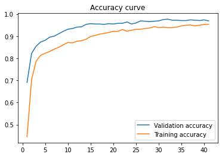
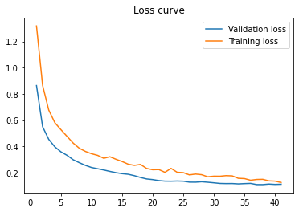
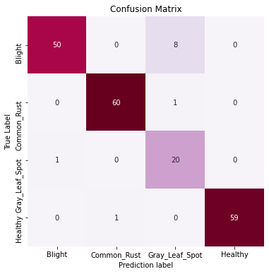
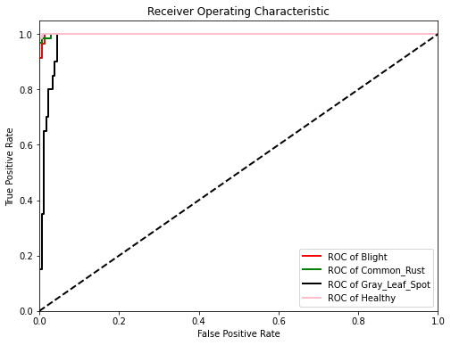

# Corn Pathology AI

#### Outcomes: 

|Sl No| Base Model |  Accuracy Curves | Loss Curve |Confusion Matrix |ROC|
|-----|------------|------------------|------------|-----------------|---|
|1| ResNet50 | | | | | 
|2| ResNet101 | | | | | 
|3| ResNet152 | | | | | 
|4| VGG-16 | | | | | 
|5| VGG-19 | | | | | 
|6| MobileNetV1 | | | || 
|7| MobileNetV2 | | | | | 
|8| EfficientNetB0 | | | | | 
|9| EfficientNetB1 | | | | | 
|10| EfficientNetB2 | | | | | 
|11| EfficientNetB3 | | | | | 
|12| DenseNet121 | | | | | 
|13| DenseNet169 | | | | | 
|14| DenseNet201 | | | | | 
|15| NasNet Mobile| | | | | 

#### Performance Metrics:

|Sl No| Base Model | Training Accuracy | Validation Accuracy | F-1 Score | Precision | Recall | AUC|
|-----|------------|-------------------|---------------------|-----------|-----------|--------|-----|
|1| ResNet50 | | | | | | | |
|2| ResNet101 | | | | | | | |
|3| ResNet152 | | | | | | | |
|4| VGG-16 | | | | | | | |
|5| VGG-19 | | | | | | | |
|6| MobileNetV1 |96.88 |95.33 |0.98 |0.97 | 0.97| 0.98|
|7| MobileNetV2 | | | | | | | |
|8| EfficientNetB0 | | | | | | | |
|9| EfficientNetB1 | | | | | | | ||
|10| EfficientNetB2 | | | | | | | |
|11| EfficientNetB3 | | | | | | | |
|12| DenseNet121 | | | | | | | ||
|13| DenseNet169 | | | | | | | |
|14| DenseNet201 | | | | | | | |
|15| NasNet Mobile| | | | | | | |

